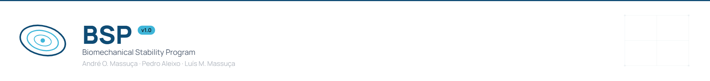
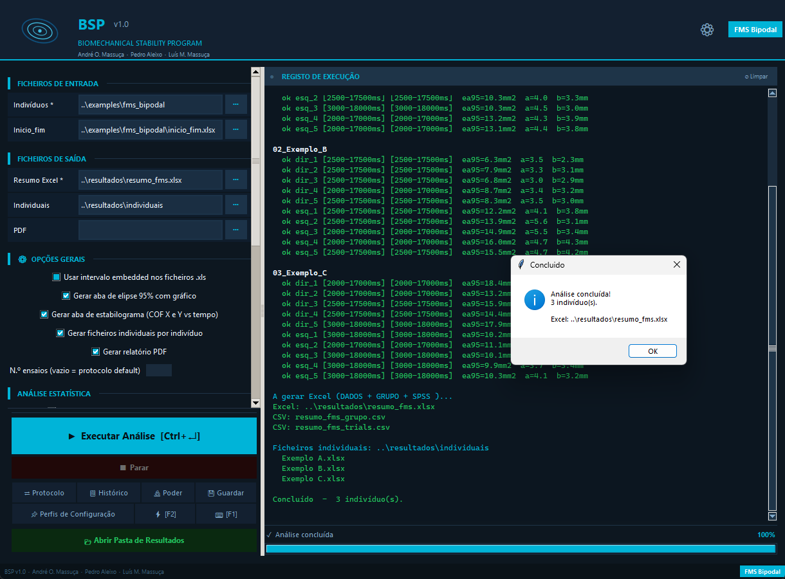
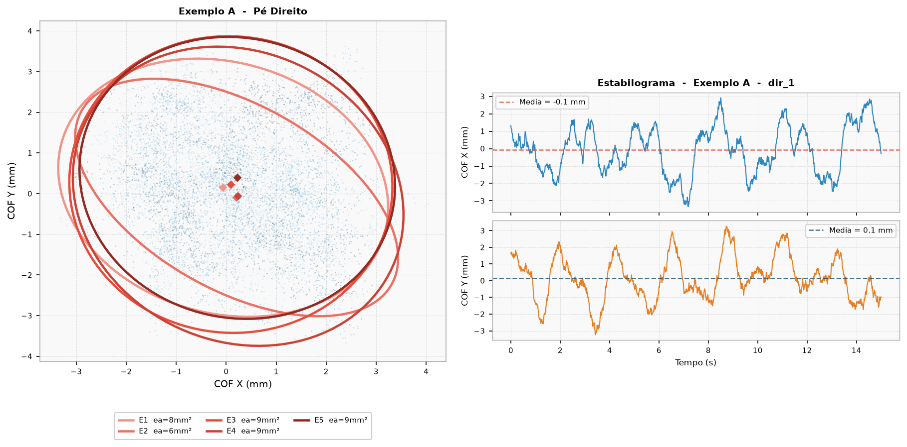

<picture>
  <source media="(prefers-color-scheme: dark)" srcset="branding/bsp_banner_dark.png">
  <source media="(prefers-color-scheme: light)" srcset="branding/bsp_banner_light.png">
  
</picture>

# BSP - Biomechanical Stability Program

[](LICENSE)
[](https://github.com/andremassuca/BSP/actions/workflows/testes.yml)

**Versão em português: [README_PT.md](README_PT.md)**



## Contents

- [What BSP is](#what-bsp-is)
- [Requirements](#requirements)
- [Installation](#installation)
  - [Quick start](#quick-start)
  - [Step-by-step guide for Windows](#step-by-step-guide-for-windows)
  - [macOS and Linux](#macos-and-linux)
- [Your first analysis with the example data](#your-first-analysis-with-the-example-data)
- [Running each protocol](#running-each-protocol)
- [Input data format](#input-data-format)
- [Troubleshooting](#troubleshooting)
- [Further documentation](#further-documentation)
- [Citing BSP](#citing-bsp)
- [Licence](#licence)
- [Authors](#authors)

## What BSP is

BSP analyses postural stability from force-plate data. It reads the centre of pressure (CoP) trajectories exported by the force plate, applies the time window of each trial and computes the usual posturography metrics:

- 95% confidence ellipse area (`ea95`);
- RMS and amplitude in X, Y and radial;
- mean CoP velocity;
- postural stiffness index (`stiff_x`, `stiff_y`);
- right/left asymmetry, where the protocol allows it;
- CoP FFT for spectral inspection.

Results are written to Excel (group summary and one file per subject) and, optionally, to a PDF report with ellipses and stabilograms.



Available protocols:

| Protocol | Trials | Analysis window |
|---|---|---|
| FMS Bipodal | 5 right + 5 left | start/end per trial |
| Single-leg Stance | 5 right + 5 left | start/end per trial |
| Pistol Shooting | 5 per distance | touch, aiming, trigger and end |
| Archery | up to 30 | between confirmation 1 and confirmation 2 |

## Requirements

- Windows 10 or 11 (BSP also runs on macOS and Linux).
- **Python 3.12 or newer** (tested with 3.12 and 3.14). Older versions do not work because the pinned scientific libraries require 3.12.
- About 500 MB of free disk space for the virtual environment.
- An internet connection during installation.

## Installation

### Quick start

If you already use Python and a terminal, these are the only commands you need (Windows):

```
git clone https://github.com/andremassuca/BSP.git
cd BSP
py -m venv .venv
.venv\Scripts\activate
pip install -r requirements.txt
cd src
python estabilidade_gui.py
```

If any of this is unfamiliar, follow the guide below.

### Step-by-step guide for Windows

#### 1. Install Python

1. Go to [python.org/downloads](https://www.python.org/downloads/) and download the latest Python (3.12 or newer) for Windows.
2. Run the installer. **On the first screen, tick "Add python.exe to PATH"** before clicking *Install Now*. This lets Windows find Python when you type commands in the terminal, from any folder.
3. Keep the default options: they include `tcl/tk and IDLE`, which BSP needs for its window.

#### 2. Get BSP

Choose one of the two options:

- **Option A, without Git (simplest):** on the [repository page](https://github.com/andremassuca/BSP), click the green **Code** button and then **Download ZIP**. Open the downloaded file, click **Extract all** and choose a folder, for example `Documents`. You get a folder called `BSP-main`.
- **Option B, with Git:** if you have [Git](https://git-scm.com/) installed, open a terminal in the folder where you want BSP and run:

  ```
  git clone https://github.com/andremassuca/BSP.git
  ```

  You get a folder called `BSP`.

From here on, "the BSP folder" means `BSP-main` (option A) or `BSP` (option B).

#### 3. Open a terminal inside the BSP folder

Open the BSP folder in File Explorer (you should see `README.md`, `requirements.txt` and the `src` and `examples` folders), then use one of these:

- click the address bar at the top of the window, type `cmd` and press Enter; or
- right-click an empty area of the folder and choose **Open in Terminal**.

A black or blue window opens. The text before the cursor (the *prompt*) shows the folder you are in, and it must end in the BSP folder, for example `C:\Users\student\Documents\BSP-main>`.

#### 4. Create and activate the virtual environment

A virtual environment (*venv*) is a private copy of Python just for BSP, so that its libraries do not interfere with anything else on the computer. Type:

```
py -m venv .venv
```

This takes a few seconds and creates a `.venv` folder. Then activate it:

```
.venv\Scripts\activate
```

**How to tell it is active:** the prompt now starts with `(.venv)`, for example `(.venv) C:\Users\student\Documents\BSP-main>`. If you see an error about scripts being disabled, see [Troubleshooting](#troubleshooting).

#### 5. Install the libraries BSP uses

With the venv active:

```
pip install -r requirements.txt
```

This downloads NumPy, SciPy, Matplotlib and the other libraries (a few minutes the first time). It should end with a line starting with `Successfully installed`.

#### 6. Check the installation

Still with the venv active, run the two automated test suites:

```
cd src
python bsp_core.py --testes
python estabilidade_gui.py --testes
```

Each takes up to a minute and ends with a line of the form `RESULTADO ... X/X testes passaram` (the messages are in Portuguese; "testes passaram" means "tests passed"). The installation is correct when, in both suites, the two numbers in that line are equal, for example `20/20`. If the first number is smaller, some tests failed: see [Troubleshooting](#troubleshooting).

#### 7. Open BSP

You are already in the `src` folder, so:

```
python estabilidade_gui.py
```

The BSP window opens. The first time, it shows the licence and terms of use: choose the language (PT, EN, ES or DE) at the top and click **I Have Read and Accept**. Then choose the protocol. The language can be changed later with the ⚙ button in the main window.

#### 8. Opening BSP again on another day

You do not need to install anything again. Open a terminal in the BSP folder (step 3) and run:

```
.venv\Scripts\activate
cd src
python estabilidade_gui.py
```

### macOS and Linux

The steps are the same, with three differences: the Python command is `python3`, the venv is activated with `source`, and on Linux `tkinter` may need to be installed separately.

```
git clone https://github.com/andremassuca/BSP.git
cd BSP
python3 -m venv .venv
source .venv/bin/activate
pip install -r requirements.txt
cd src
python estabilidade_gui.py
```

- **Linux:** if you get `No module named 'tkinter'`, install it with your system's package manager, for example `sudo apt install python3-tk` on Ubuntu/Debian or `sudo dnf install python3-tkinter` on Fedora. On Ubuntu/Debian, if `python3 -m venv .venv` says `ensurepip is not available`, install `python3-venv` first (`sudo apt install python3-venv`).
- **macOS:** use the installer from python.org, which already includes `tkinter`.

## Your first analysis with the example data

The `examples/` folder contains **synthetic** data (generated by a script, not from real people) for the four protocols. This walkthrough uses FMS Bipodal.

1. Open BSP (step 7 above) and, on the protocol screen, click **FMS Bipodal**.
2. Under **INPUT FILES** (*FICHEIROS DE ENTRADA* in Portuguese), in the **Subjects** field (*Indivíduos*), click the **...** button and choose the folder `examples\fms_bipodal` inside the BSP folder. It has one subfolder per subject (`01_Exemplo_A`, `02_Exemplo_B`, `03_Exemplo_C`).
3. In the **Start/end** field (*Inicio_fim*), click **...** and choose `examples\fms_bipodal\inicio_fim.xlsx`. This file holds the analysis window of each trial.
4. Under **OUTPUT FILES** (*FICHEIROS DE SAÍDA*), in the **Excel out** field (*Resumo Excel*), click **...**, choose a folder where you want the results (for example the BSP folder itself) and type a name such as `results_fms.xlsx`.
5. Optional: in **Individuals** (*Individuais*) choose a folder for the per-subject files. Leave **PDF** empty if you do not want the PDF report.
6. Click **Run Analysis** (*Executar Análise*). The log on the right shows each trial as it is processed, and when it finishes a window confirms that the analysis is complete for 3 subjects. Click **OK**.
7. Click **Open Results Folder** (*Abrir Pasta de Resultados*) and open `results_fms.xlsx` in Excel. The **DADOS** sheet has one row per subject with all metrics, **GRUPO** has the group statistics and **SPSS** has the data ready for SPSS.

The screenshot at the top of this page shows the window at the end of this analysis.

## Running each protocol

In every protocol, the **Subjects** folder holds one subfolder per subject, named `ID_Name` (for example `01_Exemplo_A`). BSP uses the leading number to match each folder to the right row of the timing file.

### FMS Bipodal and Single-leg Stance

- **Subjects:** `examples/fms_bipodal` (or `examples/unipodal`).
- **Start/end file:** `examples/fms_bipodal/inicio_fim.xlsx` (or `examples/unipodal/inicio_fim.xlsx`).
- Each subfolder contains `dir_1` to `dir_5` (right foot) and `esq_1` to `esq_5` (left foot).

### Pistol Shooting

- On the protocol screen choose **Functional Task** and then **Shooting**.
- **Subjects:** `examples/tiro`.
- **Timing:** `examples/tiro/tempos_tiro.xlsx`.
- Under **Intervals to compute**, choose the windows you want (touch to aiming, aiming to trigger, and so on).
- The examples have no Hurdle Step files. The related warning in the log is expected; you can untick **Include bipodal analysis (Hurdle Step)**.

### Archery

- On the protocol screen choose **Functional Task** and then **Archery**.
- **Subjects:** `examples/tiro_arco`.
- **Start/end:** `examples/tiro_arco/Inicio_fim_vfinal.xlsx`.
- **Demographic ref.** is optional and stays empty for the examples.

## Input data format

### Trial files (force-plate export)

Tab-separated text with a `.xls` extension (this is what the force-plate software exports; it is not a binary Excel file). A few header lines followed by a table:

```
Stability export for measurement: dir_1
Patient name: ...
Measurement done on 01-01-2026

Frame	Time (ms)	COF X (mm)	COF Y (mm)	Force (N)	FrameDist (mm)
0	0	0.512	-1.203	700.0	0.000
1	10	0.530	-1.187	700.0	0.024
```

The first four columns (frame, time in ms, CoP X and CoP Y in mm) are required. For Archery the columns are named `Entire plate COF X`, `Entire plate COF Y` and `Entire plate COF Force` (typically 50 Hz). `.xlsx` files with `frame`, `t_ms`, `x`, `y` columns are also accepted.

Expected file names inside each subject folder:

| Protocol | File names |
|---|---|
| FMS / Single-leg | `dir_1 ... dir_5`, `esq_1 ... esq_5` (suffixes such as ` - 01-01-2026 - Stability export.xls` are accepted) |
| Shooting | `trial{distance}_{trial} - ... .xls`, for example `trial5_1 - 01_01_2026 - Stability_export.xls` |
| Archery | `{id}_{trial} - {DD-MM-YYYY} - Stability export.xls`, for example `901_1 - 01-01-2026 - Stability export.xls` |

### Timing files (Excel)

- **FMS / Single-leg, `inicio_fim.xlsx`:** one row per subject. Column A holds the name (as in the folder name, without the ID), followed by start/end pairs in ms: trials 1 to 5 are the right foot and trials 6 to 10 the left foot.
- **Shooting:** three sheets, `tempo (toque)`, `tempo (pontaria)` and `tempo (disparo)`. Row 2 has headers in the form `5m (1)`, `5m (2)`, ...; column A holds the subject ID. In the touch sheet the first block of columns has the camera times and the second block the force-plate times; BSP converts the other events to the force-plate clock.
- **Archery, `Inicio_fim_vfinal.xlsx`:** three sheets, `tempo do toque`, `confirmação_1` and `confirmação_2`. Row 1 has `atleta_id, ensaio_1, ..., ensaio_30`, then one row per athlete. The analysis window runs from `confirmação_1` to `confirmação_2`.

Use the files in `examples/` as templates. To regenerate them: `python examples/gerar_exemplos.py`.

## Troubleshooting

| Problem | Solution |
|---|---|
| `'python' is not recognized as an internal or external command` (or `'py' is not recognized`) | Python is not installed or was installed without "Add python.exe to PATH". Run the python.org installer again, choose **Modify** (or reinstall) and tick the PATH option. Close and reopen the terminal afterwards. |
| When activating the venv in PowerShell: `running scripts is disabled on this system` | Run once `Set-ExecutionPolicy -Scope CurrentUser RemoteSigned`, answer `Y`, and activate again. Alternatively use the Command Prompt: type `cmd` in the folder's address bar (step 3). |
| `ModuleNotFoundError: No module named 'tkinter'` | On Windows, run the python.org installer again, choose **Modify** and tick `tcl/tk and IDLE`. On Linux, install `python3-tk` (see [macOS and Linux](#macos-and-linux)). |
| `ModuleNotFoundError: No module named 'numpy'` (or another library) | The venv is not active or the installation did not finish. Check that the prompt starts with `(.venv)`, then run `pip install -r requirements.txt` again from the BSP folder. |
| `Could not find a version that satisfies the requirement numpy==...` | Your Python is too old. Check with `py --version`: it must be 3.12 or newer. Install a recent Python, delete the `.venv` folder and repeat from step 4. |
| `pip install` fails for another reason (network errors, timeouts) | Check your internet connection (some institutional networks block pip; try another network). Update pip with `python -m pip install --upgrade pip` and try again. |
| `No such file or directory: 'requirements.txt'` | The terminal is not in the BSP folder. Check the prompt and repeat step 3. |
| A test fails | Open an issue (see [CONTRIBUTING.md](CONTRIBUTING.md)) with the full output of the test command. |

## Further documentation

- [MANUAL_Part1_EN.md](MANUAL_Part1_EN.md) and [MANUAL_Part2_EN.md](MANUAL_Part2_EN.md): user manual (English).
- [MANUAL_Part1_PT.md](MANUAL_Part1_PT.md) and [MANUAL_Part2_PT.md](MANUAL_Part2_PT.md): user manual (Portuguese).
- [CHANGELOG.md](CHANGELOG.md): version history.
- [CONTRIBUTING.md](CONTRIBUTING.md): how to report problems and propose changes.

## Citing BSP

If you use BSP in your work, please cite the software (see [CITATION.cff](CITATION.cff); GitHub shows a **Cite this repository** button):

Massuça, A. O., Aleixo, P., & Massuça, L. M. (2026). *BSP: Biomechanical Stability Program* (Version 1.0.2) [Computer software]. https://github.com/andremassuca/BSP

Study that used BSP: Campião, A., Aleixo, P., Massuça, A. O., Abrantes, J. M. S. C., & Massuça, L. M. (2026). Associations of BIA-Estimated Body Composition, Handgrip Strength, and Event-Defined Postural Control with Short-Range Police Precision-Shooting Accuracy: A Cross-Sectional Study. *Journal of Functional Morphology and Kinesiology*, 11(3), 272. https://doi.org/10.3390/jfmk11030272

Methodological references:

- Schubert, P., & Kirchner, M. (2013). Ellipse area calculations and their applicability in posturography. *Gait & Posture*, 39(1), 518-522.
- Prieto, T. E., et al. (1996). Measures of postural steadiness. *IEEE Transactions on Biomedical Engineering*, 43(9), 956-966.
- Winter, D. A. (1995). Human balance and posture control during standing and walking. *Gait & Posture*, 3(4), 193-214.
- Quijoux, F., et al. (2021). A review of center of pressure (COP) variables to quantify standing balance in elderly people. *Physiological Reports*, 9(22), e15067.
- Maurer, C., & Peterka, R. J. (2005). A new interpretation of spontaneous sway measures based on a simple model of human postural control. *Journal of Neurophysiology*, 93(1), 189-200.

## Licence

BSP is free software, released under the [MIT licence](LICENSE).

## Authors

André O. Massuça, Pedro Aleixo and Luís M. Massuça. See [AUTHORS.md](AUTHORS.md).
